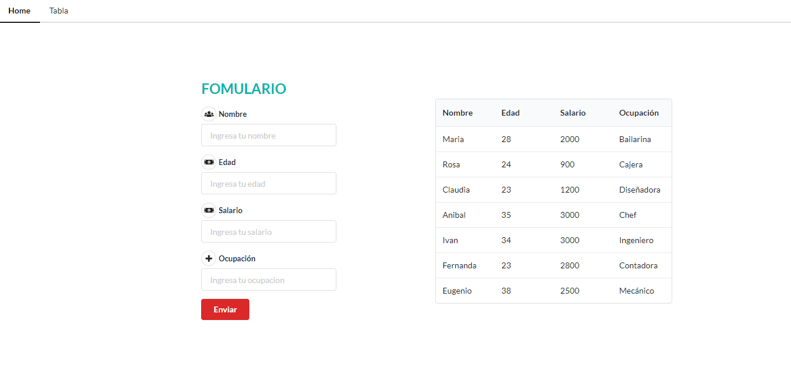
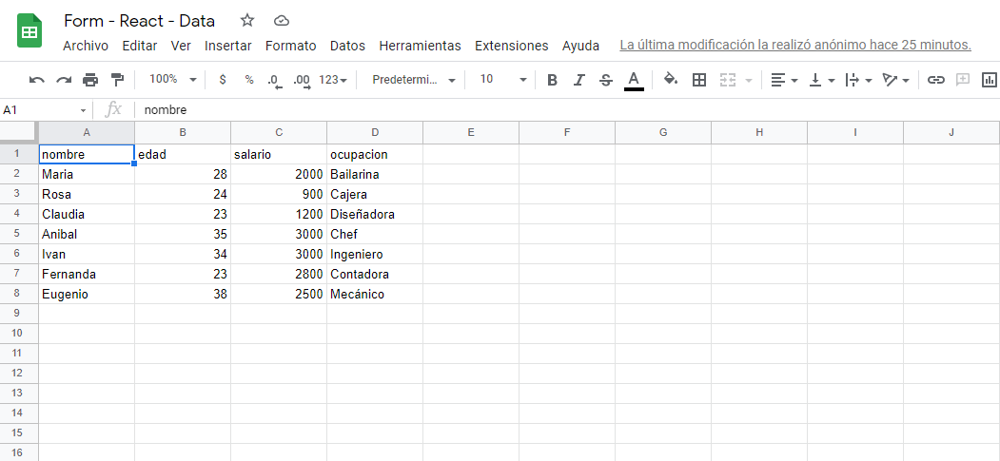
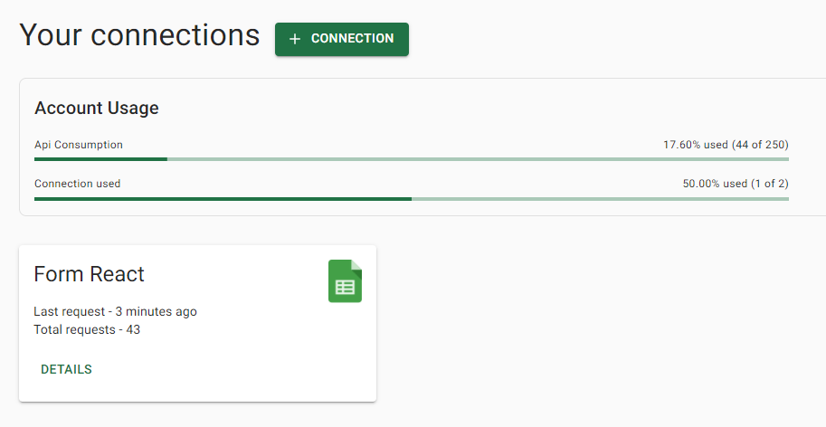

## FORM GOOGLE SHEET

## Índice

- [FORM GOOGLE SHEET](#form-google-sheet)
- [Índice](#índice)
- [- 📌 Peticiones mediante Sheet.best](#---peticiones-mediante-sheetbest)
- [1. Resumen del proyecto](#1-resumen-del-proyecto)
- [2. Guia de uso](#2-guia-de-uso)
  - [📌 Herramientas usadas:](#-herramientas-usadas)
  - [📌 Pagina principal:](#-pagina-principal)
  - [📌 Form en Google Sheet](#-form-en-google-sheet)
  - [📌 Peticiones mediante Sheet.best](#-peticiones-mediante-sheetbest)
---

## 1. Resumen del proyecto

Cómo mandar datos de formularios de una aplicación React a Google Sheets como un API REST y almacenar sus datos en Google Sheets.

Se completaran los datos del formulario se enviara, publicaremos datos en Google Sheets como una API REST, y para eso, usaremos Axios. A traves de axios mediante el url de google sheets con sheet.best para enviar las solicitus a las API (get y post).
Se podra visualizar tanto en la tabla como en el google sheet a tiempo real la data ingresada.

## 2. Guia de uso

### 📌 Herramientas usadas:

📎React
📎Semantic UI
📎Axios
📎Sheet.best

### 📌 Pagina principal:

### 📌 Form en Google Sheet

### 📌 Peticiones mediante Sheet.best
